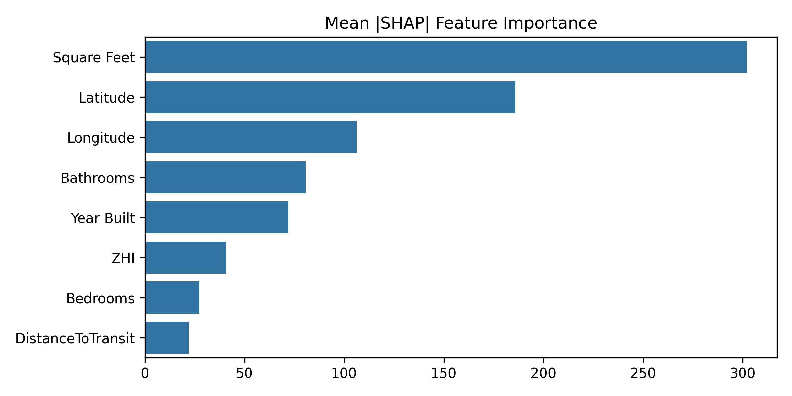
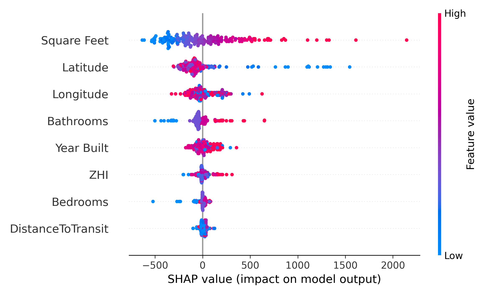

# Rent Estimate Project - Gregory Yampolsky

Hi and welcome to my GitHub repository for the Rent Estimate case study! The goal of this project is to build a machine learning model that can predict the rent price of a property based on various features such as location, size, and amenities.

 

**Email**: [gregyampolsky@gmail.com](gregyampolsky@gmail.com)

## Table of Contents
- [Folder Structure](#folder-structure)
- [Project Objective](#project-objective)
- [Project Flow](#project-flow)
- [Quick Start](#quick-start)  
- [Results](#results)
- [Next Steps](#next-steps)

## folder structure
```
├── README.md
├── requirements.txt
├── .circleci
│   └── config.yml
├── data
│   ├── NTAD_National_Transit_Map_Stops.csv
│   └── State_zhvi_bdrmcnt_1_uc_sfrcondo_tier_0.33_0.67_sm_sa_month.csv
│   └── TestSet.csv
│   └── TrainingSet.csv
│   └── Zip_zhvi_brmcnt_1_uc_sfrcondo_tier_0.33_0.67_sm_sa_month.csv
├── docs
│   ├── DataScienceProject.txt
│   └── writeup.docx
├── notebooks
│   └── EDA.ipynb
│   └── model_evals.ipynb
├── src
│   └── tests
│       ├── test_data_processing.py
│   ├── preprocessing.py
│   └──modeling.py
│   └── parameter_store.py
├── models
│   ├──any models will be saved here.joblib
│   └── model_results.csv
├── requirements.txt
└── Images
    └── rent-estimate.png
``` 
All notebooks can be found in the **[notebooks folder](./notebooks)**.  It consists of one **[exploratory data analysis workbook](./notebooks/EDA.ipynb)** showing my work on exploring different feature engineerings and **[one model evaluation and fitting notebook](./notebooks/model_evals.ipynb)** where I compared several models, fine tuned hyperparameters and evaluated residuals.

The write up I did is in the [docs folder](./docs).

## Project Objective

The company wants a Python model that estimates market rent for single-family homes across the U.S. using basic property info and location. They gave two files: one to train on (with past rented prices over the last two years) and one to test on. 
Train a model on the provided historical data (TrainingSet.csv) using:
Latitude, Longitude
Bedrooms, Bathrooms
Square Feet
Year Built
Plus the target: Close Price (i.e. the rent it actually leased for)
Use that model to predict a “Market Rent” for new properties (like the ones in TestSet.csv or any similar dataframe).
Deliver a function that takes a pandas DataFrame with those columns and returns the same DF with an extra Market Rent column.
Explain your thinking — feature choices, modeling approach, and how you would improve it with more data (neighborhood features, seasonality, amenities, etc.).

## Project Flow
### Make the path from raw  

1. `notebooks/EDA.ipynb` – explore and feature engineer
2. `notebooks/model_evals.ipynb` – compare models
3. `src/` – productionized version of the modeling logic
4. `models/` – saved artifacts


## Quick Start

```bash
python -m venv .venv
source .venv/bin/activate   # Windows: .venv\Scripts\activate
pip install -r requirements.txt
```
### function to generate predictions on the test set
```python
from src.inference import predict_market_rent
df = pd.read_csv("data/TestSet.csv")
print(predict_market_rent(df).head())
```
## Results

### Model comparison

| Model | Train MSE | Test MSE | Train R² | Test R² | Train time (s) |
|---|---:|---:|---:|---:|---:|
| XGBoost | 140,573.77 | 177,879.27 | 0.7891 | 0.7333 | 1.55 |
| HistGradientBoostingRegressor | 176,779.69 | 193,178.09 | 0.7348 | 0.7103 | 0.98 |
| ANN | 225,857.36 | 232,120.68 | 0.6612 | 0.6519 | 25.18 |
| Decision Tree | 200,387.24 | 246,487.63 | 0.6994 | 0.6304 | 1.08 |
| Linear Regression | 386,844.31 | 381,285.00 | 0.4197 | 0.4283 | 0.31 |

Source: [`models/model_results.csv`](./models/model_results.csv)

### SHAP feature importance

Global importance (sorted by mean |SHAP|):

<p align="center">
    
    <br/>
    <em>Saved by the notebook at Images/feature_importance.png</em>
  
</p>

Beeswarm (distribution across samples):

<p align="center">
    
    <br/>
    <em>Saved by the notebook at Images/feature_importance_beeswarm.png</em>
</p>

If the images don’t render yet, run the last two cells of `notebooks/model_evals.ipynb` to regenerate predictions and SHAP plots.


## Next Steps
- Dont just use average ZHI for 1 bedrooms but also for 2, 3, 4 bedrooms and use the one that matches the number of bedrooms in the property
- Add more features like crime rates, school ratings, proximity to bike lanes etc.
- Try more models like LightGBM, CatBoost, or even a simple linear regression for interpretability
- try clustering the data into regions
- try bootstrapping to fix some of the skewness of the residuals.
- experiment with non-linear transformations of the features (log, sqrt, etc.) to see if it improves model performance.
